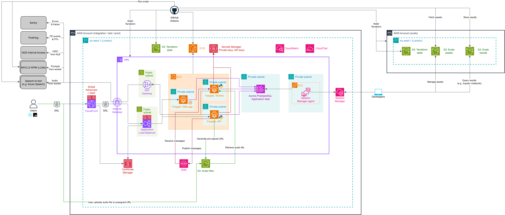
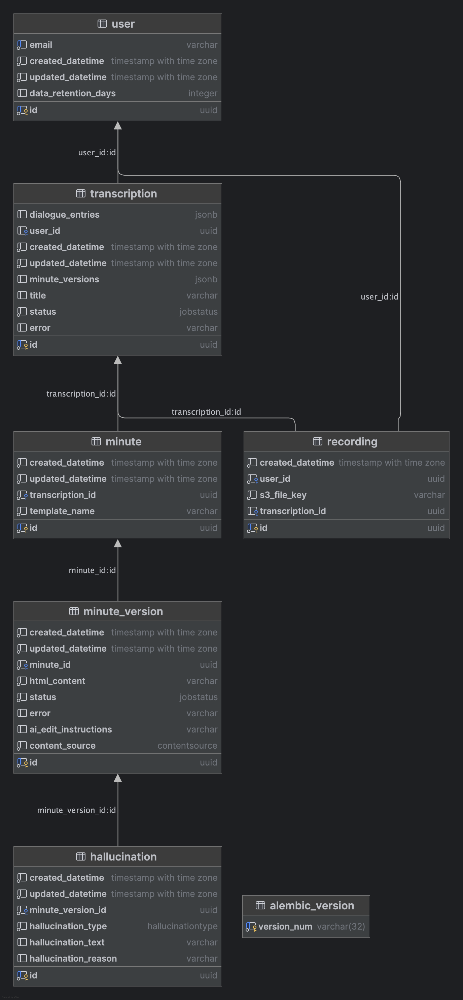

# Local Transcribe

> [!IMPORTANT]
> Incubation Project: This project is in active development and a work in progress.

Local Transcribe is an application that is designed to simplify the transcription and minuting of meetings in the public sector. Built with modern web technologies and AI-powered transcription and summarisation services, Local Transcribe transforms how government organisations handle meeting documentation by automating the conversion of audio recordings into structured, professional minutes.

## Key Features

**AI-Powered Transcription**: Local Transcribe integrates with multiple transcription services including Azure Speech-to-Text via Azure APIM, automatically selecting the most appropriate service based on audio duration and quality. The system handles various audio formats and automatically converts them to optimize transcription accuracy.

**Professional Meeting Templates**: The application includes specialized templates tailored for different types of government meetings, including Cabinet meetings, planning committees, care assessments, and general-purpose meetings. Each template follows specific formatting standards and style guides required for official documentation.

**Intelligent Minute Generation**: Beyond simple transcription, Local Transcribe uses AI to structure conversations into professional minute formats, applying proper grammar, tense conversion, and formatting rules specific to government documentation standards.

**Multi-Format Audio Support**: Upload recordings in various formats - the system automatically handles conversion and optimization for the best transcription results. Support for mono and multi-channel audio ensures compatibility with different recording setups.

**Data Retention**: Configurable data retention policies ensure compliance with government data handling requirements, with special provisions for different departments' retention policies.

**Real-Time Processing**: Asynchronous processing architecture ensures efficient handling of large audio files, with job status tracking and progress monitoring throughout the transcription and minute generation process.

Local Transcribe streamlines the traditionally time-intensive process of creating meeting minutes, allowing public sector organizations to focus on decision-making rather than documentation overhead.

## Development

#### Run the app locally

1. [Install Docker](https://docs.docker.com/desktop/setup/install/mac-install/).
2. Make a copy of the `.env.example` file and name it `.env`.
3. Run `docker compose up --build`.

This will build and run 5 containers:

1. Frontend app hosted at http://localhost:3000
2. Backend api available at http://localhost:8080
3. Worker service, which process transcriptions and does not have a public facing url
4. Postgres database hosted at http:localhost:5432
5. ElasticMQ to simulate AWS SQS

#### LLM and Transcription Services

If you want to run these services locally, see `LOCAL_SETUP.md` and follow the instructions there.

If you have access to a supported LLM and Transcription provider, you will need to fill in the associated `.env` variables and configure `common/settings.py` accordingly. For example, to use transcription and LLM services via Azure APIM, update the following values:

##### In `.env`

- Transcription + LLM: `AZURE_APIM_URL`, `AZURE_APIM_API_VERSION`, `AZURE_APIM_ACCESS_TOKEN`, and `AZURE_APIM_SUBSCRIPTION_KEY`.

Note:

- These APIM values can be found on the [Azure APIM Portal](https://portal.api.azc.test.communities.gov.uk/), including:
  - AZURE_APIM_URL in the format `https://{{host}}.gov.uk/{{product_name}}/`
  - AZURE_APIM_API_VERSION in the format `yyyy-mm-dd`
- The `AZURE_APIM_ACCESS_TOKEN` is short lived and so must be regenerated every 2 hours.

##### In `common/settings.py`:

- Update `FAST_LLM_PROVIDER`, `FAST_LLM_MODEL_NAME`, `BEST_LLM_PROVIDER`, and `BEST_LLM_MODEL_NAME` correspondingly.

This should be sufficient for local development. Keys related to 'AWS', 'Google cloud', and 'other' (Sentry/Posthog) are not required. After updating `.env`, restart the Docker container to apply changes

#### Set up your development environment:

We use dev containers to emulate the cloud environment in which Local Transcribe is usually deployed.

Running ` docker compose up --watch` will sync local file changes to the docker containers and restart them as appropriate. Note that `docker compose down` will revert the containers to their base state. See [this issue](https://github.com/docker/compose/issues/11102)

To instead configure the environemnt locally:

##### Backend

1. [Install Poetry](https://python-poetry.org/docs/).
2. In the root directory, run `poetry install`.
3. If using VS Code, open the command palette (`Command+Shift+P`), click 'Python: Select Interpreter' and select the 'minute-xxxxxxxxxx' env file Poetry has just created.

##### Frontend

- [Install node](https://github.com/nvm-sh/nvm?tab=readme-ov-file#installing-and-updating).
- In the `/frontend` directory, run `npm install`.

#### Notes

- User authenitcation and autherisation is turned off for local development, a 'dummy_user' is created for which every requested is authorised.

## Project structure

#### `frontend/`

The frontend uses Next.js. Calls to the API are made from the client-side and proxied api using Next's middleware. All API calling code is auto-generated by [Hey API](https://heyapi.dev/), the config for this can be found in `frontend/openapi-ts.config.ts`. It uses the api running locally to get the openapi.json, so to regenerate the types run the docker compose, and then run `npm run openapi-ts` in `frontend/`.

#### `backend/`

The backend uses FastAPI and is responsible for making initial database writes and sending long running processes to a queue (typically SQS)

#### `worker/`

The worker reads from the queue and executes transcription/file conversion/llm calls, and updates the database with the results

## Deployment

#### Requirements

1. [Install the AWS CLI](https://docs.aws.amazon.com/cli/latest/userguide/getting-started-install.html).
2. [Install Terraform](https://developer.hashicorp.com/terraform/install).

#### AWS access

Set up your AWS SSO profile by running:

```bash
aws configure sso
```

Enter the following when prompted:
- SSO start URL: shared with you separately
- SSO region: `eu-west-2`
- SSO Session: choose a name, e.g. `local-transcribe-dev`
- SSO Registration scopes: `sso:account:access` (this might be the default)
- Account ID: the development account ID, also shared with you separately
- Role: the developer role you have been assigned (likely 'developer_role')
- Profile name: choose a name, e.g. `developer_role_staging` or `developer_role-929514686841`

Then log in using your MHCLG super user account (`suxxxxxxx@mhclg.onmicrosoft.com`) and set the profile as the default for your session:

```bash
aws sso login --profile <your-profile>
export AWS_PROFILE=<your-profile>
```

#### Build and push helper script

The `build-and-push.sh` script builds Docker images, pushes them to ECR, and runs `terraform plan`/`apply` against the target environment:

Ask in slack for the current alarm email address to use in development, and then run:

```bash
export TF_VAR_alarm_email_address=the_email_address_you_just_got_from_slack
./build-and-push.sh [--environment development] [--tag <tag>] [frontend] [backend] [worker]
```

- `--environment` defaults to `development`; `--tag` defaults to the current git short SHA
- Optionally list one or more services to build (default: all three)

#### Terraform (development)

> [!WARNING]
> Ad-hoc Terraform runs can cause the state to drift out of sync with deployments from the development branch. Only run these commands when necessary, and always review the plan carefully before applying, it might be helpful to review with someone else too if you're unsure or anything looks risky.

To run Terraform commands directly against the development environment:

```bash
export TF_VAR_alarm_email_address=alerts@example.com
cd terraform/development
terraform init
terraform plan [-var="image_tag=<tag>"]
```
Then review the plan output carefully to check for any unexpected changes. If everything looks good, apply the changes with:
```bash
terraform apply [-var="image_tag=<tag>"]
```

> [!WARNING]
> Don't exit `terraform plan` with `CTRL+C` or by closing the terminal window, as this can cause the state to become locked. If this happens, run `terraform force-unlock` with the lock ID provided in the error message.

This uses an S3 remote backend — AWS credentials with access to the `local-transcribe-tfstate-development` bucket are required. Yours should have been included in the permissions for the developer role you were assigned.

##### Troubleshooting

If you see the following error when running `terraform plan`

```
terraform plan 
╷
│ Error: No valid credential sources found
```

You probably don't have your AWS profile selected, try running `aws sso login --profile <your-profile>` and then `export AWS_PROFILE=<your-profile>`.

#### Setting up a new environment from scratch

##### Bootstrapping the Terraform backend

1. Create `terraform/<env>/` and `terraform/<env>/backend/` by copying from `terraform/development/`, replacing all instances of `development` with your environment name and updating the domain names in `main.tf`.
2. In `terraform/<env>/backend/main.tf`, comment out the `backend "s3"` block near the top of the file.
3. `cd` into `terraform/<env>/backend` and run `terraform init` followed by `terraform apply`. The plan should show the creation of an S3 bucket called `local-transcribe-tfstate-<env>`. If everything looks correct, run `terraform apply`.
4. Once the bucket exists in the AWS console, uncomment the `backend "s3"` block and run `terraform init` again. You will be prompted to migrate the local state to the remote backend.

##### Setting up initial networking and requesting SSL certificates

1. The new environment's `variables.tf` has `ssl_certs_created` defaulting to `false` — leave it as-is for now.
2. `cd` into `terraform/<env>` and run `terraform init`, then:

```bash
terraform apply -target module.networking -target module.frontdoor -target module.certificates
```

3. Use the values in the terraform output to complete the DNS change request to MHCLG (see below).

##### Requesting DNS changes from MHCLG

Use the terraform output to complete a copy of the 'DNS Change Request Form -v2.xlsx' file in the root of the repository as follows:

- For each item in the `cloudfront_certificate_validation` and `load_balancer_certificate_validation` blocks of the output, add a row to the table where:
  - 'Change Type' is 'Add'
  - 'Requested by' is your name
  - 'Record Type' is the value from `resource_record_type`
  - 'Domain' is either `test.communities.gov.uk` or `service.gov.uk`, whichever appears as part of the value in `domain_name`
  - 'Name' is the value from `resource_record_name`
  - 'Content' is the value from `resource_record_value`
  - 'TTL' is '1 hr'
  - 'Proxy status' is 'DNS only'
  - 'Additional comment or Reason for this change' is 'Setting up environment for Local Transcribe'
- For each item in the `cloudfront_certificate_validation` block, add an additional row where:
  - 'Change Type' is 'Add'
  - 'Requested by' is your name
  - 'Record Type' is 'CNAME'
  - 'Domain' is either `test.communities.gov.uk` or `service.gov.uk`, whichever appears as part of the value in `domain_name`
  - 'Name' is the value from `domain_name`
  - 'Content' is the value from `cloudfront_dns_name`
  - 'TTL' is '1 hr'
  - 'Proxy status' is 'DNS only'
  - 'Additional comment or Reason for this change' is 'Setting up environment for Local Transcribe'
- For each item in the `load_balancer_certificate_validation` block, add an additional row where:
  - 'Change Type' is 'Add'
  - 'Requested by' is your name
  - 'Record Type' is 'CNAME'
  - 'Domain' is either `test.communities.gov.uk` or `service.gov.uk`, whichever appears as part of the value in `domain_name`
  - 'Name' is the value from `domain_name`
  - 'Content' is the value from `load_balancer_dns_name`
  - 'TTL' is '1 hr'
  - 'Proxy status' is 'DNS only'
  - 'Additional comment or Reason for this change' is 'Setting up environment for Local Transcribe'

Note that DNS changes typically take around a week to be processed.

Once the spreadsheet is completed, create a ServiceNow request with MHCLG using the general 'Request' option with the following details:

- 'What is it that you require?' → "Creation of DNS records"
- 'Why do you require it?' → "We are setting up the environment for Local Transcribe in AWS. As part of this we need DNS records for the sub-domains and associated certificates."
- Attach the completed spreadsheet to the request.

##### Setting up the rest of the environment

Once MHCLG have made the DNS changes and the certificates have been validated, run:

```bash
terraform apply -var ssl_certs_created=true -var alarm_email_address=<email>
```

This will create all remaining resources including ECS services, the RDS database, SQS queues, and Secrets Manager secrets. The secrets will be created but not populated — you will need to populate them manually via the AWS console before the service will function correctly.

#### Architecture diagram

Local Transcribe was developed to run on AWS and/or Azure, with abstractions available for message queues and cloud storage.



#### Database Schema



#### Sentry setup (optional)

To set up sentry for telemetry, create an account at [sentry.io](sentry.io).

- Navigate to the `projects` page
- Click `Create project`
- Select `FASTAPI` as project type
- Click create
- On the following page, in the `Configure SDK`, copy the value for `dsn=` **KEEP THIS SECRET**
- Navigate to the SSM parameter store entry for your deployed application
- Replace `SENTRY_DSN` value with the value you copied

#### Posthog setup (optional)

To set up posthog for UX tracking, feature flags etc, create an account at [eu.posthog.com](https://eu.posthog.com/).

- create a project and obtain an API key (it should start `phc_`)
- set the key `POSTHOG_API_KEY` value in your `.env`

## Testing

To run unit tests:

```bash
make test
```

For transcription service evaluation, see [evals/transcription/README.md](evals/transcription/README.md).

### Testing paid APIs and LLM prompt evaluations

A special set of tests are available to evaluate paid calls to LLM providers. Since we don't want to run this all the
time, we enable these with:

```bash
ALLOW_TESTS_TO_ACCESS_PAID_APIS=1
```

is in your `.env` file.

In order to run some tests, you will need some preprocessed transcript `.json` files. These should be located in
the top level `.data` dir in the repo. Within this directory, different subdirectories are routed to
different tests (see [test_queues_e2e.py](tests/test_queues_e2e.py) for an example).

## Adding custom templates

You can add your own templates by implementing either the `SimpleTemplate` or `SectionTemplate` protocols (see [here](backend/templates/types.py))
Simply put them in the [templates](backend/templates) directory, and they will automatically be discovered when the backend starts.

## Type Checking

```bash
poetry install --with dev

poetry run mypy .
# check entire project

poetry run mypy path/to/file.py
# check a specific file
```

mypy analyses type hints to catch type-related bugs before runtime. Run it before committing (further validation occurs during the CI/CD process) changes.
