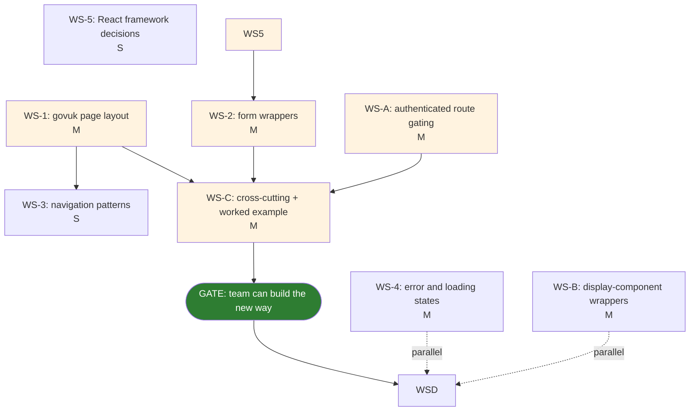

# Frontend rewrite critical path analysis

**Question:** What is the longest path of stories to be played so that the team can contribute parallely on this work? 

**Date:** 2026-05-26.

---

## Current state of the layout shell

The layout shell uses some GOV.UK class names but is not structurally canonical GOV.UK Design System:

| File | State | Evidence |
|---|---|---|
| `components/layout/header.tsx` | **Partial / mixed.** Cherry-picks `govuk-header__homepage-link`, `govuk-header__product-name`, `govuk-link--inverse`, `var(--govuk-brand-colour)` onto a raw `<header className="flex h-[64px] ... bg-[var(--govuk-brand-colour)] px-8">`. The canonical `<header class="govuk-header" data-module="govuk-header">` structure is not in use. |
| `components/layout/footer.tsx` | **Two definitions in one file.** Line 3 exports `const Footer` (Tailwind only: `bg-black px-4 py-2 text-white`). Line 21 default-exports `GovFooter` (canonical `govuk-footer`). Whichever export the consumer imports decides what renders. |
| `components/layout/alpha.tsx` (the phase banner) | **Bespoke Tailwind.** Uses `bg-blue-200`, `text-blue-600`. Not `govuk-phase-banner` with `govuk-tag`. |

**Should the layout shell land before individual form components?** Yes in practice. The layout shell is not in canonical GOV.UK Design System form. If form pages migrate to canonical GOV.UK form components but the page frame around them is bespoke Tailwind, the result will look visually inconsistent. It is not a hard technical blocker (form wrappers can be written without changing the layout files), but it is a soft visual and coherence blocker for any meaningful page migration.

---

## Workstreams

The acceptance criteria name seven minimum workstreams. Three additional workstreams are needed to cover the full scope (display-component wrappers, authenticated route gating, cross-cutting deliverables).

Each workstream has a T-shirt size: **S** ≈ under 1 day, **M** ≈ 1-3 days, **L** ≈ 3-10 days.

### Minimum workstreams from acceptance criteria

| ID | Workstream | Size | What's in it |
|---|---|---|---|
| **WS-1** | **govuk page layout** | M | Rewrite `header.tsx` to canonical `govuk-header`. Replace footer.tsx (delete the Tailwind variant, promote `GovFooter`). Replace `alpha.tsx` with canonical `govuk-phase-banner`. Add `govuk-skip-link`. Wrap `app/layout.tsx` body in `govuk-template__body` + `govuk-width-container` + `govuk-main-wrapper`. |
| **WS-2** | **individual form components** | M | Nine thin wrappers per `approach.md` decision tree: `GovukButton`, `GovukInput`+`GovukLabel`+`GovukHint`, `GovukTextarea`, `GovukSelect`, `GovukCheckboxes`, `GovukRadios`, `GovukFieldset`+`GovukErrorMessage`, `GovukErrorSummary`, `GovukBackLink`. |
| **WS-3** | **navigation patterns** | S | Replace bespoke nav in header with `govuk-service-navigation` (or `govuk-header__navigation` if the team prefers the simpler pattern). Active-state handling per page. Mobile responsive behaviour from govuk-frontend. |
| **WS-4** | **error and loading states** | M | Patterns for error pages (404, 500, 403 unauthorised) and loading skeletons. Top-level error boundary in `app/error.tsx`. Integration with existing `<GovukErrorSummary>` for form validation. The govuk-frontend doesn't ship a loading-skeleton pattern, so this is partly bespoke with govuk-tokens. |
| **WS-5** | **React framework decisions (Next.js patterns, server vs client components)** | S | Document which wrappers must carry `'use client'` (anything with event handlers, hooks, or interactive state, so `Button`, `Tabs`, `Accordion`, `Details`, `Checkboxes`/`Radios` if they manage their own state). Document server-component-safe wrappers (`Label`, `Hint`, `ErrorMessage`, `Tag`, pure-markup ones). Decision on form submission style: keep React Hook Form (client) or move to server actions (more aligned with App Router). |

### Additional workstreams

| ID | Workstream | Size | What's in it |
|---|---|---|---|
| **WS-A** | **authenticated route gating** | M | Audit current auth/role checks across pages. Standardise on a server-component check at the top of protected layouts. Closest to App Router idioms, runs before the page renders, no client-side flash of unauthorised content. Sits on the likely critical path. |
| **WS-B** | **display-component wrappers** | M | `GovukTag`, `GovukDetails`, `GovukAccordion`, `GovukNotificationBanner`. Not in AC minimum but listed in `approach.md` as part of the in-scope migration. **Tabs decision (2026-05-26):** the transcription detail page (Chat / Minute / Transcript switching) stays on Radix as a documented exception, since `govuk-tabs` is designed for static linkable tab content, not dynamic in-app switching. Static tab use elsewhere uses `GovukTabs`. |
| **WS-C** | **cross-cutting deliverables** | M | ESLint rule banning new imports from `components/ui/`, worked-example form page migration end-to-end (decision 2026-05-26: `app/settings/page.tsx` is the worked example, since it exercises the minimum 4 form wrappers without audio / TipTap complications), `govuk-frontend` v6.2 patch upgrade bundled with Sprint 1 if v6.2 is out of beta by mid-sprint, otherwise deferred. This workstream produces the "team can build the new way" gate. |

---

## Dependency map



Solid arrows are hard dependencies. Dotted arrows show parallelisable work that doesn't block the gate (or doesn't block its specific downstream). Amber fill marks the critical path. Green fill marks the "team can build the new way" gate.

---

## The critical path

The longest unavoidable chain is:

```
WS-5 (framework decisions, S)
   ↓
WS-1 (page layout, M)  ──┐  } in parallel: A and B can both run after WS-5
WS-2 (form wrappers, M) ─┤
WS-A (auth gating, M)  ──┘
   ↓
WS-C (worked-example form page end-to-end + ESLint, M)
   ↓
GATE: team can build the new way
```

**Estimated critical-path length:**

| Stage | T-shirt | Notes |
|---|---|---|
| WS-5 | S | Decisions, not implementation. Can be settled in a single sitting. |
| WS-1 + WS-2 + WS-A in parallel | M | Three workstreams, each M. If three people take one each, the longest pole is whichever finishes last (≈ M). If one person sequences them, ≈ 3×M = up to a sprint. |
| WS-C | M | Worked example + conventions doc + ESLint. Can be partly overlapped with the tail of WS-1/2/A. |

**Realistic critical-path window: ≈ 1 sprint with two people running in parallel, ≈ 2 sprints solo.**

---

## Parallelism off the critical path

These workstreams do not block the gate. They run independently once their own prerequisites are met:

- **WS-3 (navigation patterns)**: blocked only on WS-1. Can land alongside WS-2 or just after WS-1.
- **WS-4 (error and loading states)**: independent. Can start any time.
- **WS-B (display-component wrappers)**: independent of the critical path. Blocked on Open Question O3 for `Tabs` specifically.


---

## Recommended execution order

**Sprint 1 (this week):**

1. WS-5 (React framework decisions): half-day discussion plus writeup.
2. WS-1 (page layout) + WS-2 (form wrappers) + WS-A (auth gating): parallel streams. WS-1 and WS-A in particular shape WS-2's implementation, so a brief sync between owners mid-sprint is worth it.
3. WS-C (worked-example end-to-end): runs in the tail of Sprint 1 once WS-2 has at least the minimum 4 form wrappers (`Button`, `Input`/`Label`/`Hint`, `Fieldset`/`ErrorMessage`, `ErrorSummary`).
4. **Hit the GATE by end of Sprint 1.**

**Sprint 2 onwards (parallel streams):**

- Stream A: complete WS-2 (remaining form wrappers) + WS-B (display wrappers, resolve Tabs question).
- Stream B: WS-3 (navigation) + WS-4 (error and loading states).
- Out-of-band: govuk-frontend v6.2 patch upgrade, ESLint rule landing.

