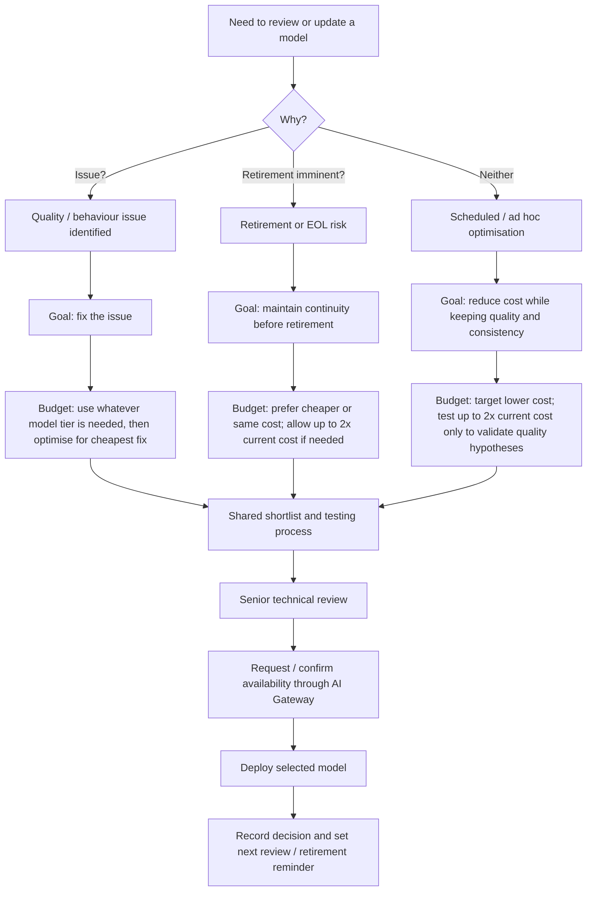
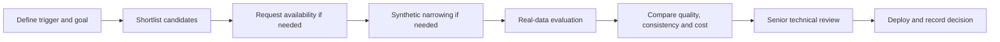

# LLM Model Replacement Lifecycle

Process for keeping LocalTranscribe models current while protecting quality, consistency, cost and service continuity.

> **Consistency over peak performance:** when this document says a model is "better", it means the model more consistently achieves good results. Prefer fewer poor outputs, lower variance and stable behaviour across templates over a model that achieves excellent results more often but also fails more often.

> **EU/UK inference only:** selected models must be available in the EU inference zone. Models available in the UK inference zone should be treated as preferred options. Do not test models outside the EU/UK inference zones with official or sensitive data. Only consider out-of-zone models when there is clear information that they are about to become available in the EU/UK zone; in that case, use synthetic data only until EU/UK availability is confirmed.

## Reference links

Use these sources when checking model availability, pricing, retirement and regional support:

| Provider | Purpose | Link |
|---|---|---|
| Azure OpenAI | Model retirement schedule | [Azure OpenAI model retirement schedule](https://learn.microsoft.com/en-us/azure/foundry/openai/concepts/model-retirement-schedule) |
| Azure OpenAI | Pricing | [Azure OpenAI Service pricing](https://azure.microsoft.com/en-us/pricing/details/azure-openai/) |
| Azure OpenAI | Model support by region | [Azure OpenAI model region availability](https://learn.microsoft.com/en-us/azure/ai-services/openai/concepts/models#region-availability) |
| Azure | Product availability by region | [Azure products by region](https://azure.microsoft.com/en-us/explore/global-infrastructure/products-by-region/table) |
| AWS Bedrock | Model lifecycle / EOL | [Amazon Bedrock model lifecycle](https://docs.aws.amazon.com/bedrock/latest/userguide/model-lifecycle.html) |
| AWS Bedrock | Pricing | [Amazon Bedrock pricing](https://aws.amazon.com/bedrock/pricing/) |
| AWS Bedrock | Model support by region | [Amazon Bedrock model support by Region](https://docs.aws.amazon.com/bedrock/latest/userguide/models-regions.html) |

## Lifecycle decision tree

## 1. Issue-driven replacement

Use this path when there is a known quality, behaviour, reliability or safety issue with the current model.

- **Primary goal:** fix the issue.
- **Cost rule:** the normal 2x cost guideline does not apply.
- **Decision rule:** choose the cheapest model that demonstrably fixes the issue.
- **Required evidence:**
  - clear description of the issue;
  - test case or dataset slice that reproduces it;
  - pass/fail definition for "fixed";
  - comparison showing which candidate models fix it;
  - cost impact of the cheapest acceptable candidate.

## 2. Retirement-driven replacement

Use this path when a model has a published retirement date, end-of-life tag, or credible retirement risk.

- **Primary goal:** maintain LocalTranscribe as a continuous service.
- **Cost rule:** prefer cheaper or same-cost replacements; allow candidates up to **2x current cost** if needed for equivalent quality or continuity.
- **Quality rule:** match current task performance first; improvement is useful but secondary.
- **Avoid:** selecting a replacement already scheduled to retire within the next **8 months**.

### Retirement monitoring

- Track retirement dates and end-of-life tags for every model we use.
- Current primary sources:
  - [Azure OpenAI model retirement schedule](https://learn.microsoft.com/en-us/azure/foundry/openai/concepts/model-retirement-schedule);
  - [Amazon Bedrock model lifecycle](https://docs.aws.amazon.com/bedrock/latest/userguide/model-lifecycle.html);
  - [Amazon Bedrock model support by Region](https://docs.aws.amazon.com/bedrock/latest/userguide/models-regions.html).
- Update these sources when model families, providers or AI Gateway routes change.
- Provider schemes vary widely:
  - a Microsoft retirement date for a cloud model does not mean AWS will retire the equivalent model at the same time;
  - warning periods, labels and enforcement dates can differ.

### Reminder rule

- Run an ad hoc retirement-date review every **2 months** to catch newly published retirement dates and schedule any missing reminders.
- As soon as a retirement date is known, set a reminder at least **4 months before** retirement.
- Use a meeting invite or scheduled Slack message to the tech team.
- Include:
  - model and provider;
  - retirement date;
  - current usage;
  - owner for the replacement review.
- Treat retirement reminders as the unhappy path: ideally, scheduled optimisation has already moved us to newer, better or cheaper models.

## 3. Scheduled / ad hoc optimisation

Use this path when there is no active issue and no imminent retirement.

- **Primary goal:** reduce overall inference cost while keeping quality the same or improving it.
- **Secondary goal:** improve consistency, especially lower variance and fewer severe failures.
- **Cost rule:** target cheaper models first.
- **Exploration rule:** it is useful to test models up to **2x current cost** to validate whether more expensive models provide meaningful quality or consistency gains.
- **Typical triggers:**
  - new models are released;
  - AI Gateway tells us a new provider, model family or deployment route is available;
  - pricing changes make the current model less attractive;
  - a regular model review shows cheaper candidates may now be viable.

### Release watching

- The LocalTranscribe team should, where possible, watch for new model releases.
- AI Gateway only enables models for us when we request them.
- Periodically ask AI Gateway:
  - which new models are available or coming soon;
  - expected lead time for enabling each model;
  - relevant regions, provider constraints or retirement warnings.

## Shared process

Apply this process for all three paths.

### Shortlist candidates

- Select models that perform the same task as the current model.
- Only shortlist models available in the EU inference zone, or models with clear upcoming EU/UK availability.
- Prefer models available in the UK inference zone where suitable.
- Prefer candidates with strong benchmark-performance-to-price ratio.
- For retirement reviews, shortlist **2-3 alternatives** where possible.
- Do not go below two alternatives unless genuinely impossible.
- Expand beyond three if there are many strong contenders.
- Check retirement status before selecting any candidate.

### Evaluate candidates

- Use the best available dataset.
- Prefer the deployed evaluation pipeline once available.
- If the pipeline is unavailable, run a local synthetic dataset first.
- Use real production data for the final comparison where available.
- Use official or sensitive data only when the model is available in the EU/UK inference zone.
- For models expected but not yet available in EU/UK zones, use synthetic data only and wait for EU/UK availability before final testing.
- If production access is slow, use synthetic data to narrow candidates before asking AI Gateway to enable a wider production set.
- Test across templates.
- Apply the best-vs-fast check in every path: larger "best" models often behave better and cost more, but periodically test that assumption by trying fast models in best-model roles.
- If using a smaller dataset:
  - randomly select the subset;
  - version it;
  - share it so others can reproduce the results.

### Report results

| Area | Required evidence |
|---|---|
| Trigger | Issue, retirement, or scheduled/ad hoc optimisation |
| Goal | Fix issue, maintain continuity, or reduce cost |
| Quality | Average scores and standard deviation |
| Failures | Count and rate of score `1` results |
| Templates | Per-template results, not only aggregate results |
| Cost | Estimated cost, using input-token price as the main proxy |
| Consistency | Variance, severe failures and stability across templates |
| Reproducibility | Dataset/subset version and run configuration |

Use input-token price as the main cost proxy because our prompts are large and outputs are small.

## Decide

- Prefer consistent output over a small mean-score increase.
- Prefer fewer score `1` results over chasing a mean score of 5.
- Normal optimisation: choose the cheapest model that keeps quality the same or improves it.
- Issue fix: choose the cheapest model that meets the explicit fix definition.
- Retirement: choose the safest continuity option that preserves quality without unnecessary cost increase.
- Get senior review from tech leads, the technical architect, or equivalent stakeholders before deployment.
