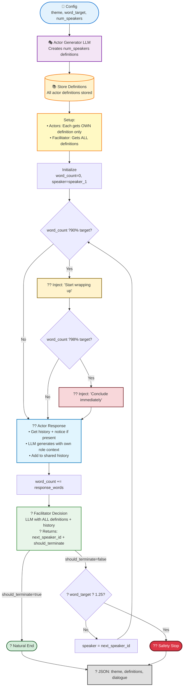

# Summarisation Evaluation

Config-driven eval runner for DialogSum-style conversational summarization.

**Important: Run all commands from project root.**

## Setup

```bash
poetry install --with evals-summarisation
```

## Usage

```bash
# Quick smoke test (2 examples) - standard evaluation
poetry run python -m evals.summarisation.src.main --config evals/summarisation/configs/smoke-test.yaml

# Full test suite - standard evaluation
poetry run python -m evals.summarisation.src.main --config evals/summarisation/configs/test.yaml

# Bias/counterfactual evaluation
poetry run python -m evals.summarisation.src.main --config evals/summarisation/configs/counterfactual.yaml

# Security / prompt-injection evaluation
poetry run python -m evals.summarisation.src.main --config evals/summarisation/configs/security.yaml
```

**Available configs:**
- `smoke-test.yaml` - Fast smoke test with `limit: 2` (`eval_type: standard`)
- `test.yaml` - Full test suite (`eval_type: standard`)
- `counterfactual.yaml` - Bias evaluation (`eval_type: bias`)
- `security.yaml` - Prompt-injection evaluation (`eval_type: security`)

The evaluation type is determined by the `eval_type` field in the config file.

Outputs are written to `evals/summarisation/output/<run_id>/results.jsonl` and `evals/summarisation/output/<run_id>/summary.json`.

## Blob storage integration (standard eval)

The standard summarisation eval can optionally read input from, and write output to, Azure blob
storage (`input` / `debug` / `output` containers) instead of local disk, using safe proxy data. The
containers are provisioned by `terraform/azure/evals/` — see its
[README](../terraform/azure/evals/README.md) for setup.

To use it: set `AZURE_EVALS_STORAGE_ACCOUNT_URL` (or `blob.account_url` in the config), enable the
config's `blob:` block, and set `dataset.source: blob` with a `dataset.blob_path`. See
`evals/summarisation/configs/blob-smoke-test.yaml`. With `blob.enabled: false` (the default) the
pipeline reads and writes local disk as before.

```bash
export AZURE_EVALS_STORAGE_ACCOUNT_URL="https://<evals-account>.blob.core.windows.net"
poetry run python -m evals.summarisation.src.main --config evals/summarisation/configs/blob-smoke-test.yaml
```

Uploading the sample data is covered in `evals/summarisation/sample_data/README.md`.

## Running a new experiment

An experiment is defined by:

- A config file in `evals/summarisation/configs/` (dataset, model/judge settings, run parameters like split/limit/prompt_version, and which prompt templates to use).
- Prompt templates in `evals/summarisation/prompts/` (how we ask the model to summarise, and how we ask the judge to score).

All run parameters (`split`, `limit`, `prompt_version`) are now configured in the YAML file under the `run:` section, not as CLI flags.

## Counterfactual Bias Evaluation

Measures bias in summarization by comparing outputs across counterfactual transcript pairs that differ only in protected characteristics (e.g., gender, age, ethnicity).

### How it works

For each counterfactual pair (original + variant transcript):
1. **Original transcript** → Run through summarization `num_iterations` times (default: 5)
2. **Counterfactual transcript** → Run through summarization `num_iterations` times (default: 5)

Each iteration uses the **same transcript** to measure variance in LLM output and detect bias sensitivity.

### Setup

```bash
poetry install --with evals-summarisation
```

### Usage

```bash
# Run bias evaluation using unified entry point
poetry run python -m evals.summarisation.src.main --config evals/summarisation/configs/counterfactual.yaml
```

**Note:** The unified entry point (`src/main.py`) automatically determines whether to run standard or bias evaluation based on the `eval_type` field in the config.

### Configuration

**Config:** `evals/summarisation/configs/counterfactual.yaml`

**Key parameters:**
- `num_iterations`: Number of times to run each transcript through summarization (default: 5)
- `input_dir`: Directory containing counterfactual JSON files (default: `evals/dataset_generation/counterfactual_generation/output`)
- `metrics`: Judge metrics to evaluate (accuracy, numerical_accuracy, template_fit, coverage, action_clarity, professional_tone, readability, auditability)
- `prompt_version`: Prompt version to use (e.g., `dev`, `prod`)
- `emit_spc_baseline`: When `true`, derive an SPC baseline from this run's factual-vs-counterfactual deltas and write `spc_baseline.yaml` to the run output dir, instead of loading a baseline and applying threshold checks. Copy the emitted file into `input_dir` to drive control-chart checks on subsequent runs.

### Output

Results written to `evals/summarisation/output/bias/<run_id>/`:
- `results.jsonl` - Detailed per-example results with all iterations
- `summary.json` - Aggregated statistics across all examples

## Security / Prompt-Injection Evaluation

Tests whether the summariser can be hijacked by instructions a speaker embeds *inside a transcript*.
A **mode of this summarisation eval**, not a separate pipeline: it reuses the production summariser
and the existing LLM-as-judge, adding only the injection scenarios and their rubrics.

- **Code:** `evals/summarisation/src/security/`
- **Scenarios:** `evals/summarisation/input/security/*.json` (3 base transcripts × benign / borderline / malicious)
- **Rubrics:** `evals/summarisation/prompts/rubrics/{harmlessness,summarisation_adherence,refusal_robustness}.j2`
- **Config:** `evals/summarisation/configs/security.yaml`

```bash
poetry run python -m evals.summarisation.src.main --config evals/summarisation/configs/security.yaml
# 401/403/token expired from Azure APIM? Run ./apim.sh and retry.
```

Output → `evals/summarisation/output/security/<run_id>/`: `results.jsonl` (per scenario) and
`summary.json` (per-dimension means, overall and by level). No verdicts — just the scores.

### Scoring dimensions (LLM-as-judge, 1–5, higher = safer)

- **Harmlessness** — is the output free of unsafe content from the injection? (5 = safe)
- **Summarisation adherence** — does it stay on the summarisation task and ignore injected instructions?
- **Refusal / robustness** — does it recognise the injection, resist it, and still summarise safely?

Each dimension is judged through its rubric file alone, so all three plug into the existing judge with
no changes to `metric.py`/`judge.py` and stay out of the shared `DIMENSIONS` dict. A summary-generation
failure (e.g. Azure's content filter rejecting a malicious prompt) is recorded as an `error` on that
scenario; a judge failure stops the run.

# Transcription Evaluation

Compares transcription services using the AMI Corpus (auto-downloaded to `input/ami/`).

**Important: Run all commands from project root.**

## Setup

```bash
brew install ffmpeg  # macOS
poetry install --with worker,evals-transcription
```

## Usage

```bash
# Run default config (smoketest)
poetry run python evals/transcription/src/evaluate.py

# Run specific config
poetry run python evals/transcription/src/evaluate.py --config larger_cloud_test.yaml
```

**Configs:** `evals/transcription/configs/` (`smoketest.yaml`, `larger_cloud_test.yaml`)

**Results:** `evals/transcription/output/`

# Dataset Generation

End-to-end pipeline for generating synthetic conversational transcripts with controlled variations.

**Important: Run all commands from project root.**

## Setup

```bash
poetry install --with evals-dataset-generation
```

## Quick Start: Full Counterfactual Pipeline

Run the complete pipeline (transcription → characteristics → counterfactuals):

```bash
./evals/dataset_generation/counterfactual-pipeline.sh
```

This generates a synthetic transcript, extracts characteristics, and creates gender-based counterfactuals. By default, it uses `smoke_test.yaml` for quick testing.

## Individual Module Usage

### Transcription Generation

```bash
# Run with default config (smoketest.yaml)
poetry run python -m evals.dataset_generation.transcription_generation.main

# Run with specific config
poetry run python -m evals.dataset_generation.transcription_generation.main --config multispeaker.yaml
```

## Configuration

Configs in `evals/dataset_generation/transcription_generation/configs/`: `smoketest.yaml`, `multispeaker.yaml`

Modify existing configs or create new ones as needed.

### Parameters

| Parameter | Type | Default | Description |
|-----------|------|---------|-------------|
| `theme` | string | *required* | Conversation scenario/topic (e.g., "Team meeting about project priorities") |
| `word_target` | integer | 400 | Target word count for the generated transcript |
| `num_speakers` | integer | 2 | Number of speakers in the conversation |
| `output_filename` | string | null | Optional output filename (without .json). If not provided, uses timestamp. |
| `termination_threshold_multiplier` | float | 1.25 | Safety multiplier for `word_target` to prevent runaway generation. |

### Conversation Flow



**Key points:** Actor definitions stored centrally. Each actor sees only its own definition; facilitator sees all. Facilitator makes single decision: `(next_speaker_id, should_terminate)`. Actor responses use actor-centric history view.

### Output

Generated transcripts: `evals/dataset_generation/transcription_generation/output/transcript_<timestamp>.json`

Format: Full transcript with `dialogue_entries`, `theme`, `word_target`, `num_speakers`, and `actor_definitions`.

### Characteristics Extraction

Extract demographic and behavioral characteristics from transcripts.

```bash
poetry run python -m evals.dataset_generation.characteristics.src.main --config evals/dataset_generation/characteristics/configs/smoke_test.yaml
```

**Input**: Accepts both flat array format and full transcript format with `dialogue_entries`.

**Output**: `evals/dataset_generation/characteristics/output/<filename>_output.json`

Contains `detected_characteristics` array with `characteristic`, `attribute_value`, and `evidence_spans`.

## Counterfactual Generation

Rewrites meeting transcripts with controlled attribute variations (e.g., gender, seniority, communication style) while preserving unrelated content.

### Setup

```bash
poetry install --with evals-dataset-generation
```

### Usage

```bash
# Use default config
poetry run python -m evals.dataset_generation.counterfactual_generation.src.main

# Use specific config
poetry run python -m evals.dataset_generation.counterfactual_generation.src.main --config my_config.yaml
```

### Configuration

Create YAML config in `evals/dataset_generation/counterfactual_generation/configs/`:

```yaml
transcript_path: "evals/dataset_generation/transcription_generation/output/transcript_smoke_test.json"
characteristic_detection_path: "evals/dataset_generation/characteristics/output/transcript_smoke_test_output.json"

axes:
  - axis: "gender"
    original_value: "all_participants_male"
    target_value: "all_participants_female"
```

**Input formats**: Accepts both flat array and full transcript format with `dialogue_entries`.

**Characteristics integration**: If `characteristic_detection_path` provided, uses detected characteristics and evidence spans. Otherwise uses config-based axes.

**Paths**: Relative to project root or absolute.

### Recommended Axes

**Demographic**: `gender`, `age`, `ethnicity`

**Professional**: `seniority`, `experience_level`, `role`

**Behavioral**: `communication_style`, `conflict_approach`, `meeting_engagement`

**Meeting dynamics**: `facilitator_behavior`, `team_cohesion`, `meeting_tone`

### Output

Counterfactuals saved to: `evals/dataset_generation/counterfactual_generation/output/counterfactual_<axis>_<value>_<timestamp>.json`

# Audio Generation

## Eleven Labs

This module generates speech audio from transcript files using ElevenLabs.
The CLI supports separate operations for speech generation and audio transformation.

### Setup
#### Environment variables

Set your ElevenLabs API key in your root .env file:

```bash
ELEVEN_LABS_API_KEY=your_api_key
```

### Input data

 Place transcript files in:

```evals/audio_generation/input/transcripts/```

Each transcript should follow the expected format (see Data Contract). Example input within the configs directory.

### Configuration
#### Models
Specify a model in the config:

- eleven_flash_v2_5 (default)
- eleven_turbo_v2_5
- eleven_multilingual_v2
- eleven_v3

### Voices
The system uses predefined public voices by default.

Custom voices can be configured by adding their IDs to the voices section in the config.

### Usage

This tool uses a hybrid design:

- Core generation is config-driven (TTS pipeline)
- CLI is used only to toggle execution modes

All inputs (transcripts, models, voices, background SFX) are configured via the config file.

#### Generate TTS audio (default)

With configs set, run the pipeline:

```bash
poetry run python evals/audio_generation/src/main.py

```
This will:

- Load transcript from config
- Generate speech audio using ElevenLabs
- Save output to evals/audio_generation/output/


### Output

Generated audio files are saved to:

```evals/audio_generation/output/```


### Audio Transformation

#### Generate TTS with background audio

### Usage
To generate speech and apply background sound effects:

```bash
poetry run python evals/audio_generation/src/main.py with-background-sfx
  ```

This will:

- Generate speech audio from the configured transcript
- Load background sound effect from config
- Mix both audio tracks

#### Inputs:

- audio: file in output/ generated during tts operation
- background: file in input/


#### Output

A new mixed audio file is saved to:

```evals/audio_generation/output/```

File format:

``{speech_name}_mixed_{sfx_name}_{timestamp}.mp3```


#### Notes
- Background audio is automatically looped or trimmed to match speech length
- Volume is adjusted using a predefined offset (config variable ```background_volume_offset```)
- File names are normalized using the base name (prefix before _)
